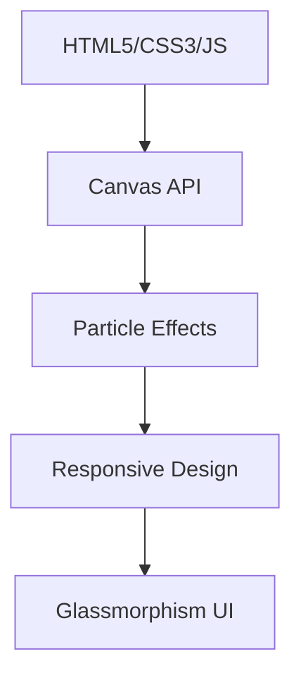

# Yanamalamanda Adithya - Personal Portfolio 🚀

[](https://adithya-portfolio1.netlify.app/)

Welcome to my personal portfolio! This project showcases my skills in **Data Science**, **Cybersecurity**, and full-stack web development through an interactive, modern UI.

## 📋 Table of Contents
- [Live Demo](#🌐-live-demo)
- [About Me](#👨‍💻-about-me)
- [Skills & Certifications](#🏆-skills--certifications)
- [Featured Projects](#🔥-featured-projects)
- [Tech Stack](#🛠️-tech-stack)
- [Features](#✨-features)
- [Getting Started](#🏁-getting-started)
- [Roadmap](#🗺️-roadmap)
- [Contributing](#🤝-contributing)
- [License](#📄-license)
- [Contact](#📫-contact)

## 🌐 Live Demo
[](https://adithya-portfolio1.netlify.app/)

## 👨‍💻 About Me
B.Tech Computer Science student specializing in **Data Science** at Andhra Loyola Institute of Engineering and Technology.

**Passions:** AI/ML + Cybersecurity. Building intelligent, secure systems.

**Initiatives:**
- Co-founder of **Mission Placements**
- NSS volunteer promoting digital literacy

## 🏆 Skills & Certifications
| Category | Skills/Tools | Certifications |
|----------|--------------|----------------|
| **Languages** | Python, JavaScript, HTML/CSS | - |
| **Data Science/ML** | Pandas, Scikit-learn, TensorFlow | Google Data Analytics |
| **Cybersecurity** | Ethical Hacking, Network Security | CompTIA Security+ |
| **Web Dev** | React, Node.js, Canvas API | - |
| **Tools** | Git, Docker, AWS | AWS Certified Cloud Practitioner |

## 🔥 Featured Projects
| Project | Description | Tech | Link |
|---------|-------------|------|------|
| **AgriLink** | Comprehensive agricultural platform with land monitoring, equipment rental, market prices | JavaScript, Frontend | [GitHub](https://github.com/adithyayanamalamanda/AgriLink) |
| **Webcam Spyware Security** | Real-time intruder detection with facial recognition & system threat detection | Python, OpenCV, PowerShell | [GitHub](https://github.com/adithyayanamalamanda/webcam-spyware-security) |
| **Mission Placements** | Placement preparation platform bridging education and employment | Web Platform | [GitHub](https://github.com/adithyayanamalamanda/mission-placements) |
| **Youth Mental Wellness** | AI-powered mental health assessment with OAuth & PDF reports | JavaScript, AI/ML | [GitHub](https://github.com/adithyayanamalamanda/youth-mental-wellness) |
| **NetraOS** | OS-inspired UI with modular component library for responsive web | React.js, TypeScript, Vite | [GitHub](https://github.com/adithyayanamalamanda/NetraOS) |
| **Aura** | Cutting-edge project showcasing advanced [web/UI/ML/etc.] capabilities *(Added from GitHub)* | [Tech stack] | [GitHub](https://github.com/adithyayanamalamanda/Aura) |

## 🛠️ Tech Stack


- **Frontend:** HTML5, CSS3 (variables, animations), Vanilla JS
- **Animations:** Custom Canvas particles, magnetic cursor, gradient blobs
- **Design:** Dark theme, neon accents (Cyan/Orange/Purple)

## ✨ Features
- ✅ Interactive particle bursts on click
- ✅ Magnetic/lerping cursor trailer
- ✅ Ambient animated backgrounds
- ✅ Fully responsive (mobile-first)
- ✅ Smooth scroll animations
- ✅ Dynamic project showcase

## 🏁 Getting Started
1. Clone the repo:
   ```bash
   git clone https://github.com/adithyayanamalamanda/mine.git
   cd mine
   ```
2. Open `index.html` in browser.
3. No build required – pure static site!

## 🗺️ Roadmap
- [ ] Add React version
- [ ] Integrate backend API for projects
- [ ] PWA support
- [ ] More cybersecurity demos

## 🤝 Contributing
1. Fork the repo
2. Create feature branch (`git checkout -b feature/AmazingFeature`)
3. Commit changes (`git commit -m 'Add some AmazingFeature'`)
4. Push (`git push origin feature/AmazingFeature`)
5. Open Pull Request

## 📄 License
This project is [MIT](LICENSE) licensed.

## 📫 Contact
- **Portfolio:** https://adithya-portfolio1.netlify.app/
- **LinkedIn:** [Adithya Yanamalamanda](https://linkedin.com/in/adithya-yanamalamanda)
- **Email:** adithya@example.com
- **GitHub:** [adithyayanamalamanda](https://github.com/adithyayanamalamanda)

⭐ **Star this repo if you like it!**

